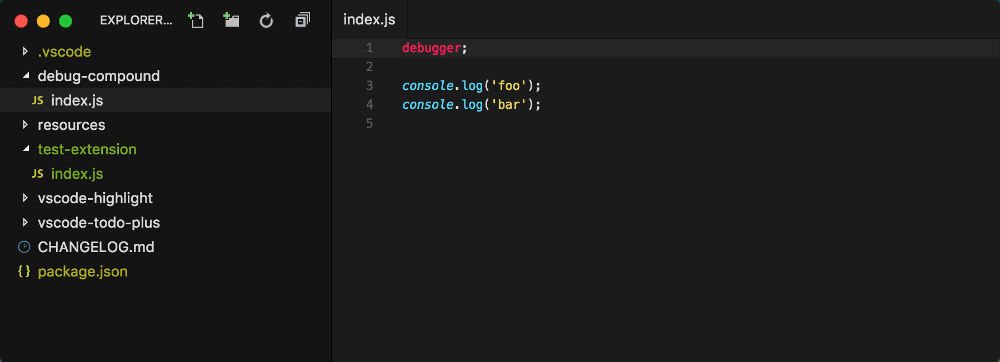
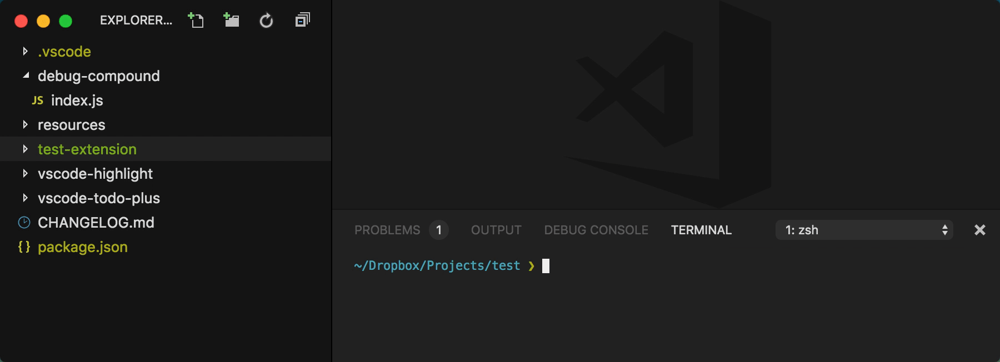

# Debug Launcher

<p align="center">
	
</p>

Start debugging, without having to define any tasks or launch configurations, even from the terminal.

This extension will generate a launch configuration for you, unless you explicitly provide one, via one of its included launch configurations [providers](https://github.com/fabiospampinato/vscode-debug-launcher/tree/master/src/providers).

There's currently built-in support for Node.js projects/files and VSCode extensions. Support for other types of projects/files can be added easily, PRs are welcome.

## Install

Follow the instructions in the [Marketplace](https://marketplace.visualstudio.com/items?itemName=fabiospampinato.vscode-debug-launcher), or run the following in the command palette:

```sh
ext install fabiospampinato.vscode-debug-launcher
```

## Usage

#### Auto

Run the `Debug Launcher: Auto` command to automatically start debugging. The launch configuration will be generated this way:

- If you defined any launch configurations => ask which one to use, unless there's only one
- If your project is a VSCode extension => generate a launch configuration for it
- If your project is a Node.js project and the `bin`/`main` field in `package.json` is set => generate a launch configuration for it
- If your current file is a Node.js file => generate a launch configuration for it

#### File

Run the `Debug Launcher: File` command to automatically start debugging the current file.

#### Terminal

You can also launch VSCode's debugger from the terminal, this extension defines a custom URI handler that looks like this:

`vscode://fabiospampinato.vscode-debug-launcher/<command>?args=<arg1>,<arg2>,<argN>`

You can substitute `<command>` with the name of any command defined by this extension, like `auto`, `file` or `launch`.

You can substitute `<argN>` with an argument to pass to the command. Any JSON-parsable value or string is allowed.

Some examples:

```sh
open 'vscode://fabiospampinato.vscode-debug-launcher/auto?args=/path/to/project' # Trigger `Debug Launcher: Auto` on the provided path
open 'vscode://fabiospampinato.vscode-debug-launcher/file?args=/path/to/foo.js' # Trigger `Debug Launcher: File` on the provided path
open 'vscode://fabiospampinato.vscode-debug-launcher/launch?args={"type":"node","name":"Foo","request":"launch","program":"/path/to/foo.js"}' # Launch the debugger using a custom launch configuration
```

[Here](docs/terminal.md) there are some helper functions/plugins for launching the debugger from the terminal.

## Settings

Each launch configuration [provider](https://github.com/fabiospampinato/vscode-debug-launcher/tree/master/src/providers) has a name, you can overwrite its configuration and commands via the settings:

```js
{
  "debugLauncher": {
    "[project.node]": { // Name of the provider wrapped in brackets
      "configuration": { // Configuration settings to override
        "stopOnEntry": true
      },
      "commands": [ // Commands to execute before launching the debugger
        "npm run bundle",
        "./prepare"
      ]
    }
  }
}
```

## Demo

#### Auto


#### File



#### Terminal



## Hints

- **[StatusBar Debugger](https://marketplace.visualstudio.com/items?itemName=fabiospampinato.vscode-statusbar-debugger)**: this other extension has built-in support for Debug Launcher and allows you to debug with a click. Also it gives you a debugger in the statusbar.

## Contributing

If you found a problem, or have a feature request, please open an [issue](https://github.com/fabiospampinato/vscode-debug-launcher/issues) about it.

If you want to make a pull request you can debug the extension using [Debug Launcher](https://marketplace.visualstudio.com/items?itemName=fabiospampinato.vscode-debug-launcher).

## License

MIT © Fabio Spampinato
